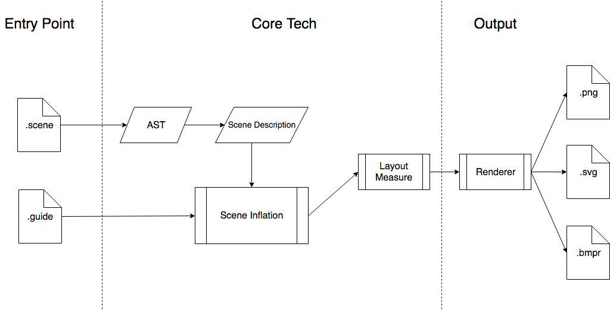

# ImagineUI
CLI tool to generate wireframes from a localized human-readable format

:warning: Work in progress :wrench: :construction:

### Basic concepts

* Scene (.scene) – Describes entities and general areas designed to allow user to access certain features.
[Details in code](src/types/logic.ts)
* Guides (.guide) – Target-specific instructions for building layouts (i.e. to accommodate screen resolution, UI guidelines, etc.)

#### Principles
* [Unix way](https://en.wikipedia.org/wiki/Unix_philosophy). 
    * Hence 1 input file corresponds to 1 output. Advanced templating is to be done with higher-order tools (i.e. [Foliant](https://foliant-docs.github.io/docs/))
* DocOps; VCS, CI, Single-source, integration into existing toolsets should be as seamless as possible 
* .scene format should feel familiar for tech.writers, as they are the most possible candidates for user-base.
* Output should not try to look like too much like a mock-up, so as not to be confused with the final product before any UI/UX designer steps in.  



### Roadmap

- [x] Scene Inflation/Layout Measurement tech.demo with Flexbox, hardcoded .guide and .yaml scene descriptions
- [ ] Define the .guide API, rules to choose widgets and an enhanced renderer
- [ ] Test coverage, CLI UX, usage docs with API and popular cases
- [ ] Document (Gherkin-like) .scene format, implement a parser
- [ ] Optimize rendering time (prebuilt TS, running daemon, incremental builds, etc.)

### Similar work
* [Gherkin/Cucumber](http://cucumber.io/) – Successful natural-feeling language framework 
* [PlantUML Salt](http://plantuml.com/salt) – Good DocOps experience, poor UI renders 
* Text adventures – Scene/Props/Actions routine somewhat make sense to describe UI

## Usage

### Demo SVG render from the internal scene structure
```
npm run start -- --input ./tests/messenger.yaml --output ./messenger.svg
```